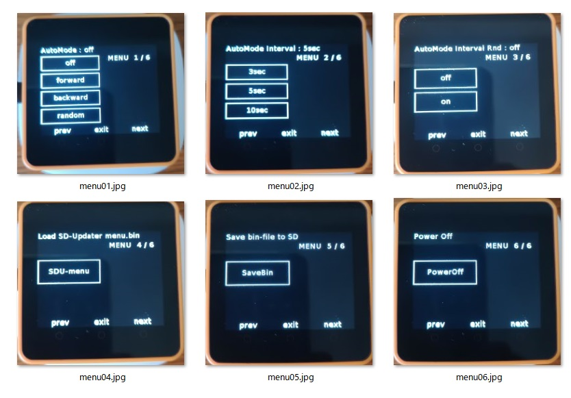

# SDU-ImageView

SD-Updaterに対応した画像ファイルの表示ツールです。<br>
SD上の<b>"/Pictures"フォルダ</b>内の画像ファイル(jpg/png形式)を対象とします。<br>
最大５０枚。フォルダは、設定ファイルで変更可能です。<br>

※画像と設定ファイルのサンプルを用意しています。SDにフォルダを作成してコピーしてご使用ください。
<br>
<br>


## 手動（Manul）モード  <br>
  BtnA:逆順(backward)・BtnC:正順(forward)を押すたびに、<b>ファイル名の並び</b>で画像を切り替えて表示します。<br>
  <br>
  <br>


## 自動（Auto）モード  <br>
  設定ファイル（"/app/imageView/imgView.json"）に従い表示。<br>
  または、<b>BtnBの長押し</b>で、設定メニュー（SettingMenu）で変更する。<br>
<br>
  ### AutoMode:<br>
  AutoMode時の画像の表示順の指定する。<br>
  <br>

      0:off　... AutoModeを使用しない <br>
      1:forward<br>
      2:backward<br>
      3:random<br>
<br>

  ### AutoModeInterval<br>
  AutoMode時の画像の表示する間隔時間の設定<br>
  設定ファイルでは、[mSEC]単位で設定する。<br>

    SettingMenuでは、次の３択<br>
      3sec<br>
      5sec<br>
      10sec<br>
  <br>

  ### AutoModeInterval Random<br>

  表示間隔のMaxをAutoModeInterval時間としてたランダム時間にするかどうか。<br>
    
    false : off<br>
    true  : on<br>
  <br>
  <br>

## 設定メニュー（SettingMenu）：BtnB長押し<br>
  
  <br>
  
  <b>BtnA: prev</b>　前のmenu<br>
  <b>BtnB: exit</b>　SettingMenuを抜ける<br>
  <b>BtnC: next</b>　次のmenu<br>
<br>

  ### 1.AutoMode:<br>
  AutoMode時の画像の表示順の指定<br>

      0:off<br>
      1:forward<br>
      2:backward<br>
      3:random<br>
<br>

  ### 2.AutoModeInterval<br>
  AutoMode時の画像の表示する間隔時間<br>
  
      3sec<br>
      5sec<br>
      10sec<br>
  <br>

  ### 3.AutoModeInterval Random<br>
  
      off<br>
      on<br>
  <br>
  
  ### 4.Load SD-Updater menu.bin<br>
<br>
SD-Updaterの menu.bin を呼出し、他のアプリに切り替えます。<br>
<br>

 ### 5.Save bin-file to SD<br>
現在動いてるアプリをSDにbinファイルとして保存します。<br>
<br>

 ### 6.Power Off<br>
電源を切ります。<br>
<br><br>

## 設定ファイル
設定ファイルは、SDの"/app/imgView/imgView.json" です。<br>
初期動作の設定を行います。<br>

```json
{
  "AutoMode": 0,
  "AutoModeInterval": 5000,
  "AutoModeRandomized": false,
  "DataDir" : "/Pictures"
}
```
  "AutoMode"　　　　 -->  "0" to "3" <br>
  "AutoModeInterval"     　 -->  interval Time [mSec]<br>
  "AutoModeRandomized"      -->  "true" or "false"<br>
  "DataDir" : "/Pictures"　 -->  画像フォルダ指定<br>
<br>  

## 対応ハードウエア
### 本体:　 M5Stack Core2
- M5Stack Core2 for AWS（動作確認している機種）<br>
- M5Stack Core2 <br>
<br>

### SD:　 FAT32 format
SDは、相性等があるので動作が不安定になるものがありますので注意が必要です。</b><br>
<br><br>


## 参照情報
以下の情報を参考にさせていただきました。<br>

SAITO, Tetsuya：3110さん m5stack-image-viewer<br>
https://github.com/3110/m5stack-image-viewer

<br>

このソフトのGitHub<br>
https://github.com/NoRi-230401/SDU-ImageViewer

<br><br><br>


